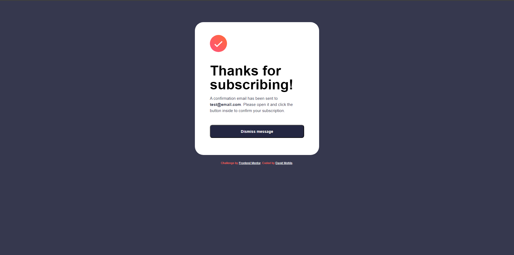
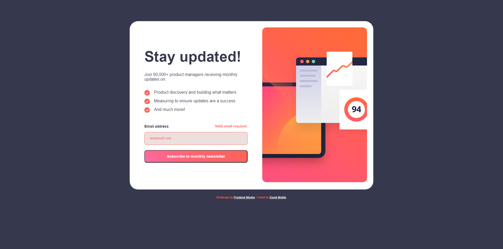
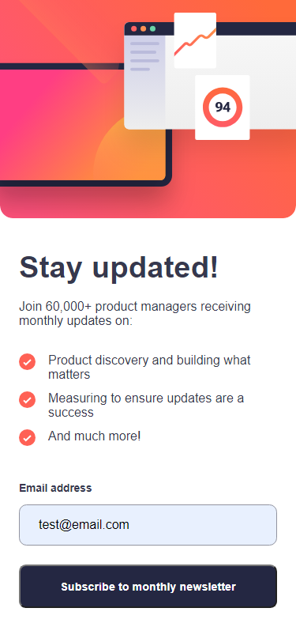
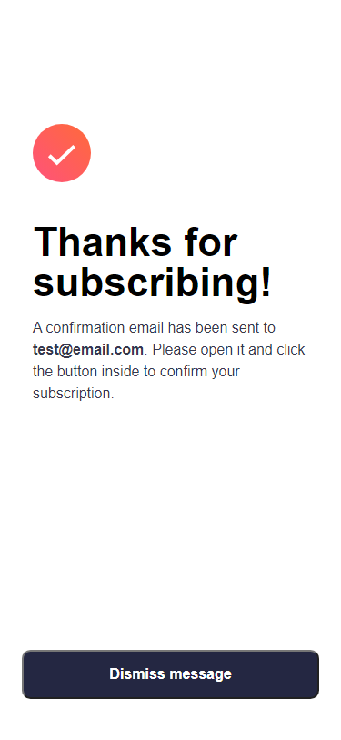
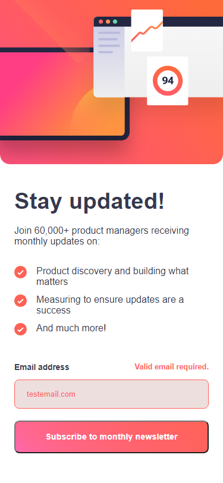

# Frontend Mentor - Newsletter sign-up form with success message

This is a solution to the [Newsletter sign-up form with success message challenge on Frontend Mentor](https://www.frontendmentor.io/challenges/newsletter-signup-form-with-success-message-3FC1AZbNrv). Frontend Mentor challenges help you improve your coding skills by building realistic projects.

## Table of contents

- [Overview](#overview)
  - [The challenge](#the-challenge)
  - [Screenshot](#screenshot)
- [My process](#my-process)
  - [Built with](#built-with)
  - [What I learned](#what-i-learned)
  - [Continued development](#continued-development)
- [Author](#author)

## Overview

### The challenge

Your challenge is to build out this newsletter form and get it looking as close to the design as possible.

You can use any tools you like to help you complete the challenge. So if you've got something you'd like to practice, feel free to give it a go.

Your users should be able to:

- Add their email and submit the form
- See a success message with their email after successfully submitting the form
- See form validation messages if:
  - The field is left empty
  - The email address is not formatted correctly
- View the optimal layout for the interface depending on their device's screen size
- See hover and focus states for all interactive elements on the page

### Screenshot

## My Process

### Built With

- Semantic HTML5
- Custom CSS
- Javascript

### What I Learned

This was my first dive into Frontend Mentor and coding based on design files. I learned where I need to focus attention to while coding and how to go about working from a design. I considered using Sass instead of custom CSS, but wanted to try my hand at a custom solution for my first challenge.

### Continued Development

In the future I want to try using more vh and vw values and best practices on where to use them in my code. I also want to start utilizing Sass as I don't have much experience with it and want to start branching out beyond my comfort zone.

## Author

David Mohlis